# StudyOS

> A role-gated, all-in-one study workspace for students and developers — built with React 19, Firebase, and a glassmorphic dark-mode design system.

[](https://react.dev)
[](https://firebase.google.com)
[](https://vitejs.dev)
[](https://tailwindcss.com)
[](./LICENSE)

---

## What It Includes

- **Auth & Navigation** — Google OAuth 2.0, GitHub OAuth, email/password, role-aware routing, global search.
- **Academic Tracking** — Courses, assignments, grades, and a review hub.
- **Spaced Repetition & Recall** — Scientific SuperMemo SM-2 algorithm flashcard decks with 3D flip card review and AI deck generator.
- **Projects Hub** — Full project lifecycle: task boards, bug tracker, code snippets, file manager, GitHub repo sync, docs editor, submission versioning.
- **Study Content** — Notes, resources, papers, and an interactive YouTube video workspace with transcripts, chapters, bookmarks, AI summaries, and quizzes.
- **Planning & Productivity** — Weekly planner, Google Calendar integration, reminders, focus timer, goals, and comprehensive student finance tracker.
- **Analytics & Admin** — Learning charts, heatmaps, AI insights, admin portal with role-based access control.
- **AI Companion** — Orion AI study assistant and context-aware tutor.
- **Infrastructure** — Firebase Auth, Firestore, Storage, Cloudflare Pages/Assets, and Cloud Functions.

---

## Stack

| Layer | Technologies |
|---|---|
| **Frontend** | React 19, Vite, React Router v7 |
| **Styling** | Tailwind CSS v4, MUI v9, Emotion, Framer Motion |
| **Backend** | Firebase Auth, Firestore, Storage, Hosting, Cloud Functions |
| **Data & State** | TanStack Query, DnD Kit, Recharts |
| **Content** | React Markdown, React Player, react-pdf, jsPDF, PapaParse, XLSX |
| **Integrations** | Google OAuth, Google Calendar, GitHub OAuth, PostHog, Sentry, Stripe |

---

## Getting Started

### Prerequisites

- Node.js 18 or newer
- npm
- A Firebase project with Auth, Firestore, and Storage enabled
- Google OAuth credentials (for sign-in and Calendar features)
- Optional: GitHub OAuth, Stripe, PostHog, Sentry, SMTP for Cloud Functions

### Install

```bash
npm install
```

### Environment

Copy `.env.example` to `.env.local` and fill in the values:

```bash
# Firebase
VITE_FIREBASE_API_KEY=
VITE_FIREBASE_AUTH_DOMAIN=
VITE_FIREBASE_DATABASE_URL=
VITE_FIREBASE_PROJECT_ID=
VITE_FIREBASE_STORAGE_BUCKET=
VITE_FIREBASE_MESSAGING_SENDER_ID=
VITE_FIREBASE_APP_ID=
VITE_FIREBASE_MEASUREMENT_ID=

# Auth & Integrations
VITE_GOOGLE_CLIENT_ID=
VITE_GITHUB_CLIENT_ID=
VITE_STRIPE_PRO_PRICE_ID=
VITE_POSTHOG_KEY=
VITE_POSTHOG_HOST=
VITE_SENTRY_DSN=
VITE_RECAPTCHA_SITE_KEY=
```

> Cloud Functions also require server-side secrets — see [docs/DEPLOYMENT.md](docs/DEPLOYMENT.md) and [GITHUB_OAUTH_SETUP.md](GITHUB_OAUTH_SETUP.md) for details.

### Run Locally

```bash
npm run dev
```

Open the local Vite URL printed in the terminal.

---

## Scripts

```bash
npm run dev      # Start the Vite dev server
npm run build    # Production build
npm run lint     # ESLint
npm run preview  # Preview the production build locally
npm run test     # Vitest
```

---

## Project Layout

```text
src/
  components/    Shared UI, modals, layout, error boundary, Orion companion
  context/       Auth, theme, reminders, Google Calendar, Orion state
  features/      Page-level modules: courses, notes, projects, videos, chat, admin, and more
  hooks/         Storage, platform, online, gamification, Google Calendar hooks
  services/      Firebase, Firestore, storage, Google Calendar, email, AI, metrics
  theme/         MUI theme and design-system provider
  utils/         Helpers and export utilities
functions/       Firebase Cloud Functions
server/          Optional Node.js scaffold
public/          Hosted app assets and SPA redirects
docs/            Architecture, development, deployment, testing, and UI guidance
```

---

## Key Modules

| File | Purpose |
|---|---|
| [src/App.jsx](src/App.jsx) | Root routing, auth gating, notifications, and app shell |
| [Dashboard.jsx](src/features/Dashboard/Dashboard.jsx) | Landing workspace |
| [Courses.jsx](src/features/Courses/Courses.jsx) | Course management |
| [Assignments.jsx](src/features/Assignments/Assignments.jsx) | Assignment deadlines & status |
| [Projects.jsx](src/features/Projects/Projects.jsx) | Full project lifecycle hub |
| [Workspace.jsx](src/features/Workspace/Workspace.jsx) | Project detail workspace |
| [Notes.jsx](src/features/Notes/Notes.jsx) | Rich-text note editor |
| [Resources.jsx](src/features/Resources/Resources.jsx) | Resource library |
| [Papers.jsx](src/features/Papers/Papers.jsx) | Academic papers manager |
| [Videos.jsx](src/features/Videos/Videos.jsx) | Interactive YouTube study player |
| [Analytics.jsx](src/features/Analytics/Analytics.jsx) | Learning charts & AI insights |
| [Goals.jsx](src/features/Goals/Goals.jsx) | Goal setting & tracking |
| [Budget/index.jsx](src/features/Budget/index.jsx) | Budget tracker |
| [WeeklyPlanner.jsx](src/features/Planner/WeeklyPlanner.jsx) | Weekly study planner |
| [Timer.jsx](src/features/Timer/Timer.jsx) | Focus timer |
| [Grades.jsx](src/features/Grades/Grades.jsx) | Grade tracker |
| [Chat.jsx](src/features/Chat/Chat.jsx) | Real-time chat |
| [Admin.jsx](src/features/Admin/Admin.jsx) | Admin portal |
| [Settings.jsx](src/features/Settings/Settings.jsx) | Account & app settings |

---

## Firebase & Deployment

StudyOS is configured for Firebase Hosting and Cloud Functions. Config and security rules live in [`firebase.json`](firebase.json), [`firestore.rules`](firestore.rules), [`storage.rules`](storage.rules), [`database.rules.json`](database.rules.json), and [`firestore.indexes.json`](firestore.indexes.json).

```bash
firebase deploy --only hosting
firebase deploy --only functions
firebase deploy --only firestore:rules
firebase deploy --only storage:rules
firebase deploy --only firestore:indexes
```

The hosting setup uses [`public/_redirects`](public/_redirects) and [`firebase-hosting/index.html`](firebase-hosting/index.html) for SPA routing.

---

## Testing

Vitest is configured at the repo root. Setup lives in [`vitest.config.js`](vitest.config.js) and [`src/test/setup.js`](src/test/setup.js).

```bash
npm run test
```

---

## Documentation

| Document | Description |
|---|---|
| [docs/ARCHITECTURE_OVERVIEW.md](docs/ARCHITECTURE_OVERVIEW.md) | System architecture and data flow |
| [docs/DEVELOPMENT.md](docs/DEVELOPMENT.md) | Local development guide |
| [docs/DEPLOYMENT.md](docs/DEPLOYMENT.md) | Firebase deployment steps |
| [docs/TESTING.md](docs/TESTING.md) | Test setup and strategy |
| [docs/UI_SYSTEM_GUIDELINES.md](docs/UI_SYSTEM_GUIDELINES.md) | Design system and component conventions |
| [docs/SECURITY.md](docs/SECURITY.md) | Security model and Firestore rules |
| [GITHUB_OAUTH_SETUP.md](GITHUB_OAUTH_SETUP.md) | GitHub OAuth configuration |
| [CHANGELOG.md](CHANGELOG.md) | Version history |
| [ROADMAP.md](ROADMAP.md) | Planned features and phases |

---

## Screenshots

<details>
<summary><strong>🔐 Authentication</strong></summary>
<br>

| Sign In | Sign Up |
|:---:|:---:|
|  |  |

</details>

<details>
<summary><strong>📊 Dashboard & Analytics</strong></summary>
<br>

| Dashboard | Analytics |
|:---:|:---:|
|  | 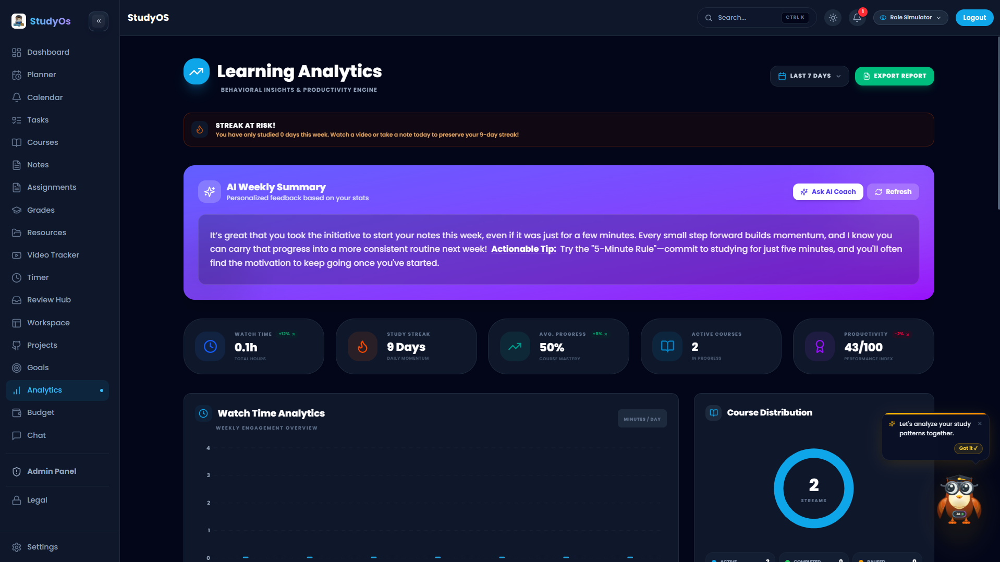 |

</details>

<details>
<summary><strong>📚 Academic Tracking</strong></summary>
<br>

| Courses | Assignments | Grades |
|:---:|:---:|:---:|
|  | 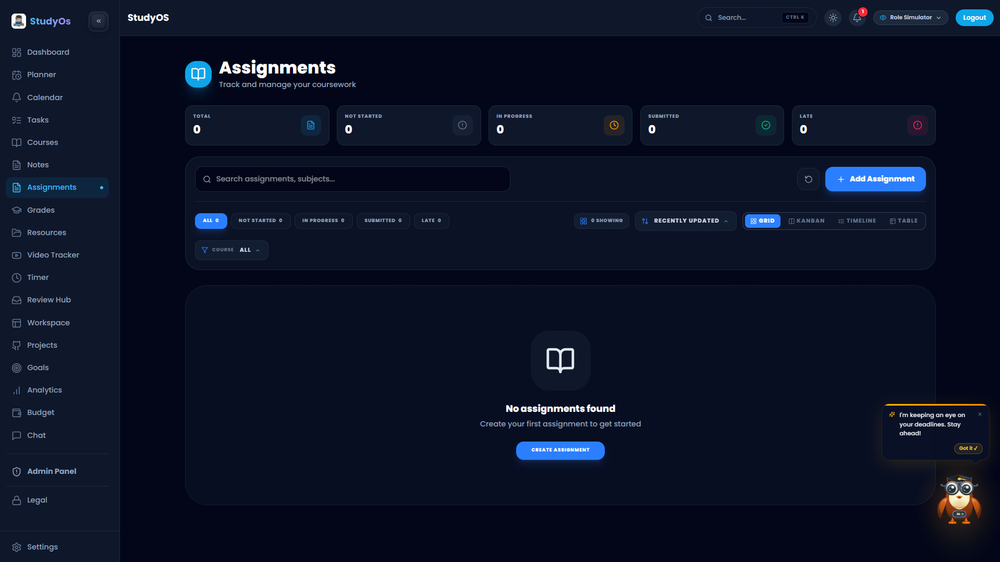 | 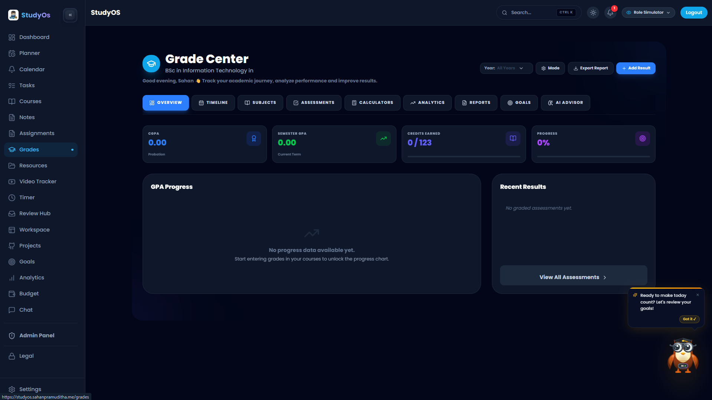 |

| Review Hub | Calendar |
|:---:|:---:|
| 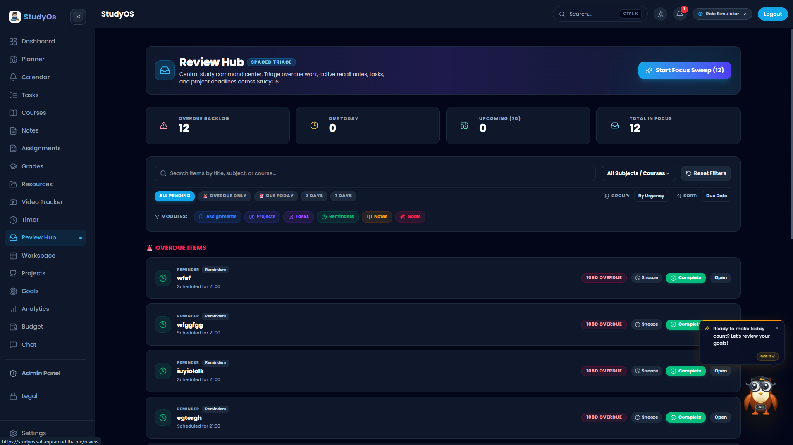 | 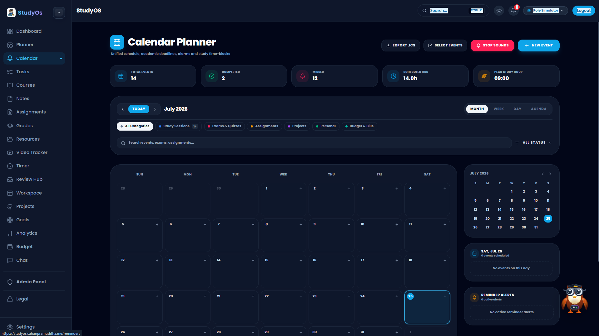 |

</details>

<details>
<summary><strong>🗂️ Projects & Workspace</strong></summary>
<br>

| Projects | Workspace |
|:---:|:---:|
| 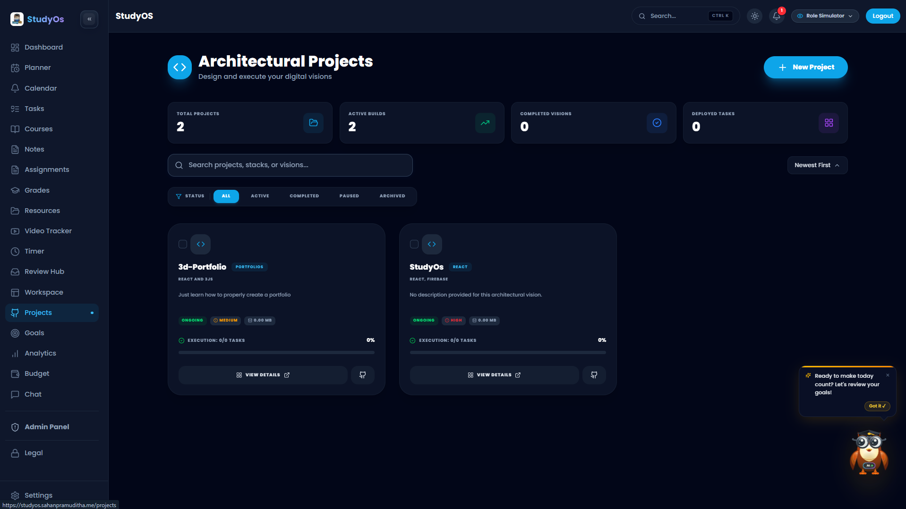 | 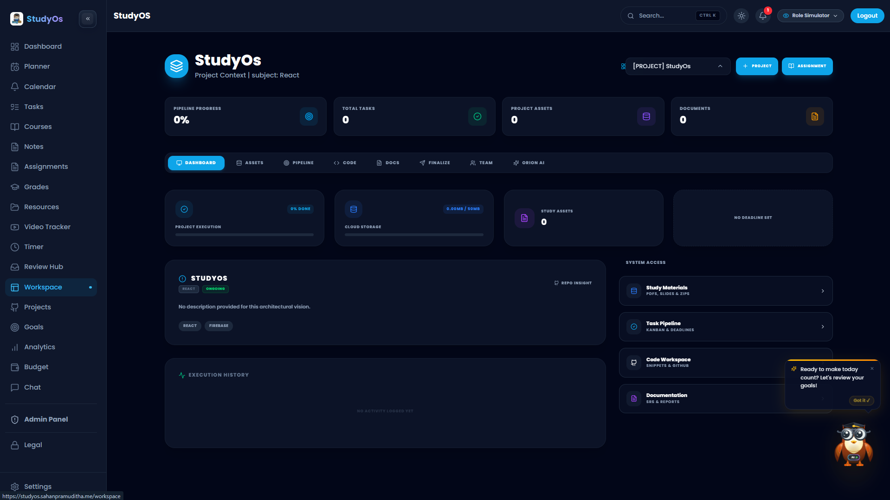 |

</details>

<details>
<summary><strong>📝 Study Content</strong></summary>
<br>

| Notes | Resources | Video Tracker |
|:---:|:---:|:---:|
|  |  |  |

</details>

<details>
<summary><strong>⏱️ Planning & Productivity</strong></summary>
<br>

| Planner | Timer | Goals |
|:---:|:---:|:---:|
| 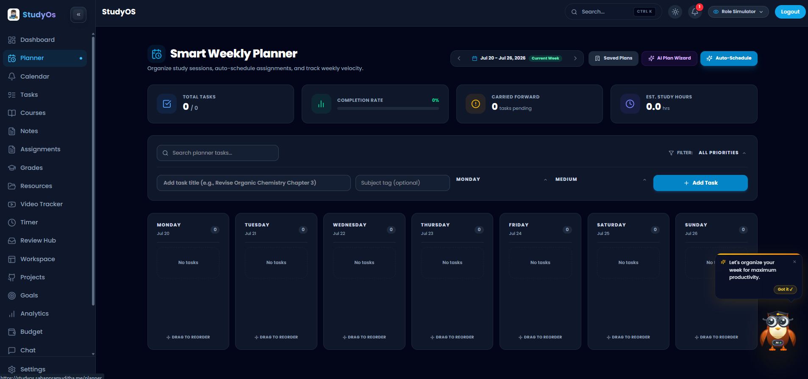 |  | 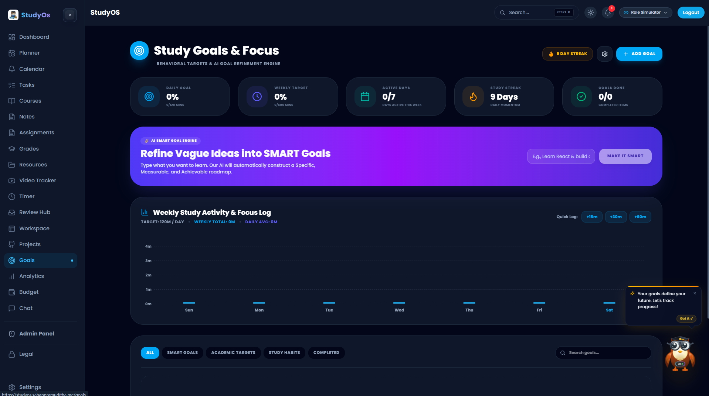 |

| Tasks | Budget |
|:---:|:---:|
|  | 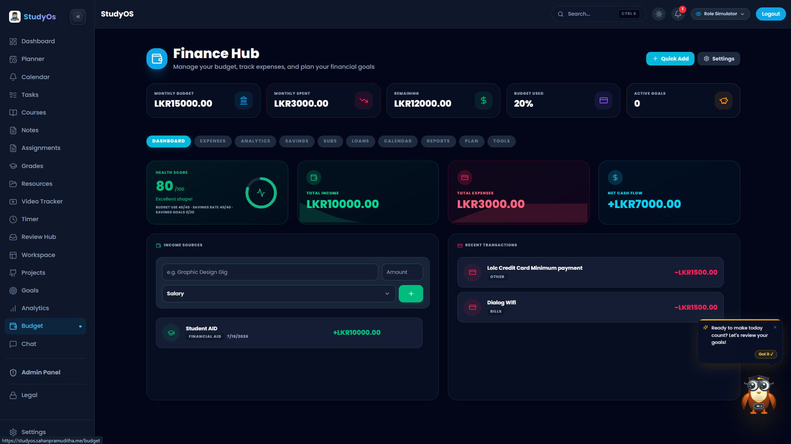 |

</details>

<details>
<summary><strong>💬 Collaboration & AI</strong></summary>
<br>

| Chat | Orion AI |
|:---:|:---:|
| 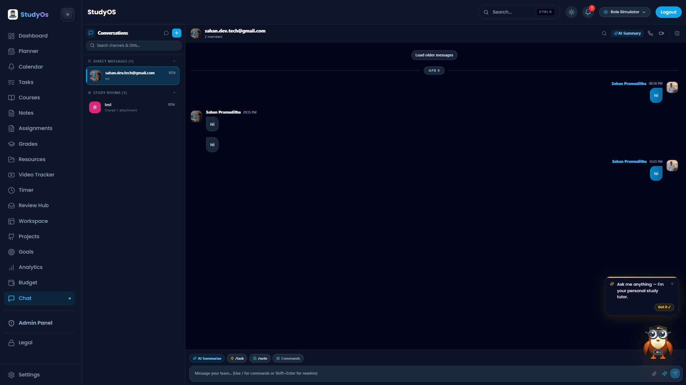 | 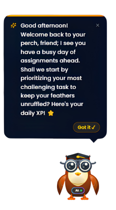 |

</details>

<details>
<summary><strong>⚙️ Settings & Admin</strong></summary>
<br>

| Settings | Admin Panel |
|:---:|:---:|
|  | 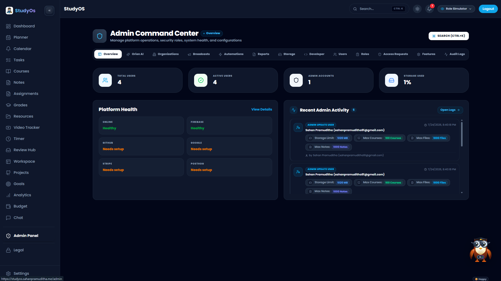 |

</details>

---

## Notes

- The `server/` package is an optional Node scaffold; the primary application stack is the Vite frontend + Firebase.
- Prettier is not in the current toolchain; linting is handled with ESLint.
- Some integrations (Stripe, PostHog, Sentry, GitHub OAuth) are optional and require the corresponding env vars.

---

## License

© 2026 Sahan Pramuditha. All rights reserved. See [LICENSE](./LICENSE) for details.