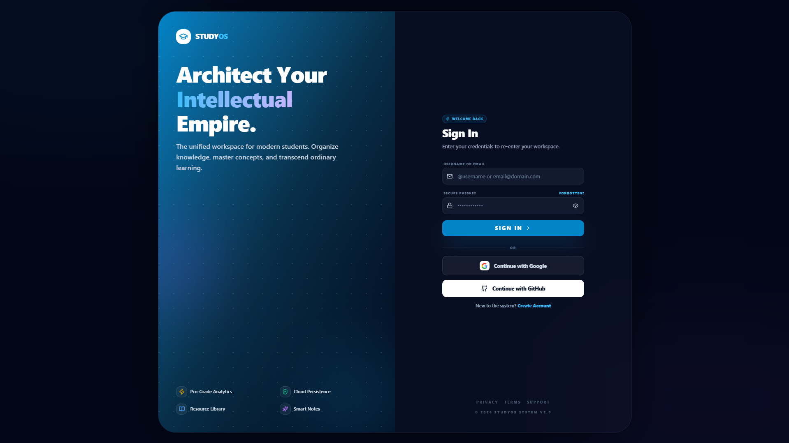
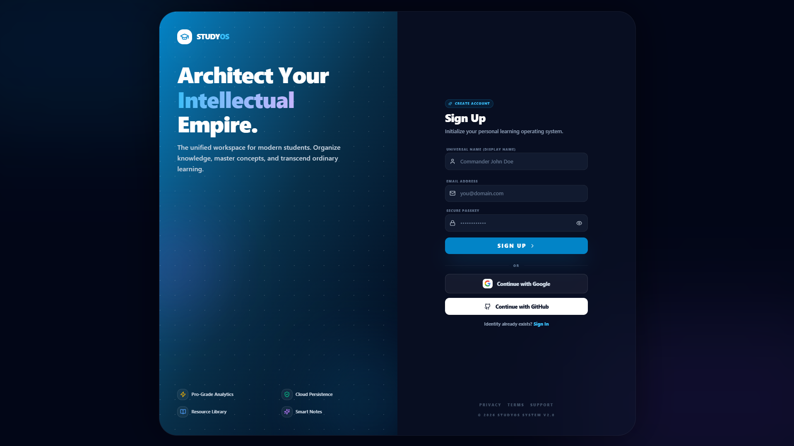
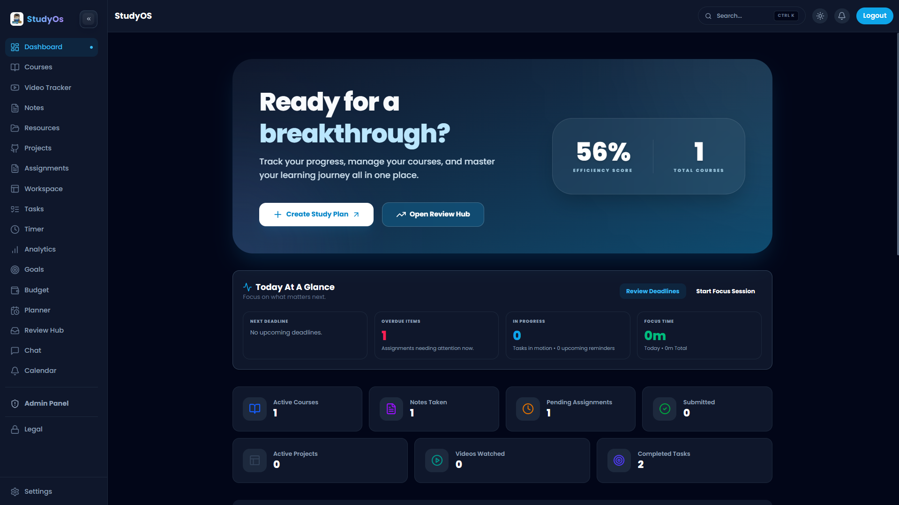
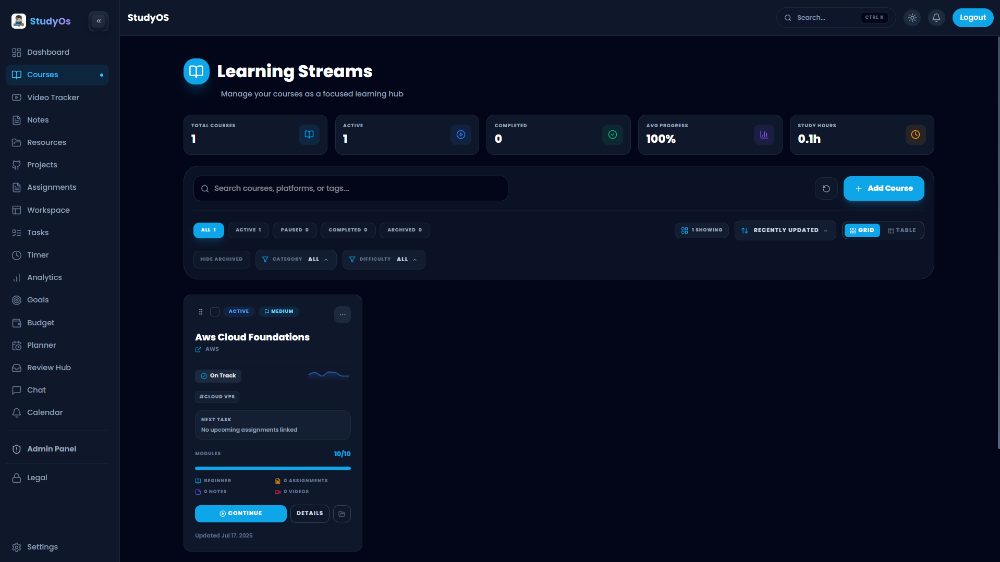
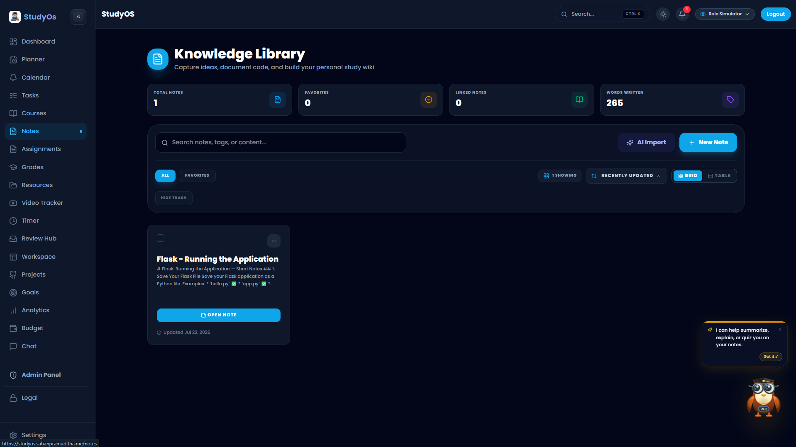
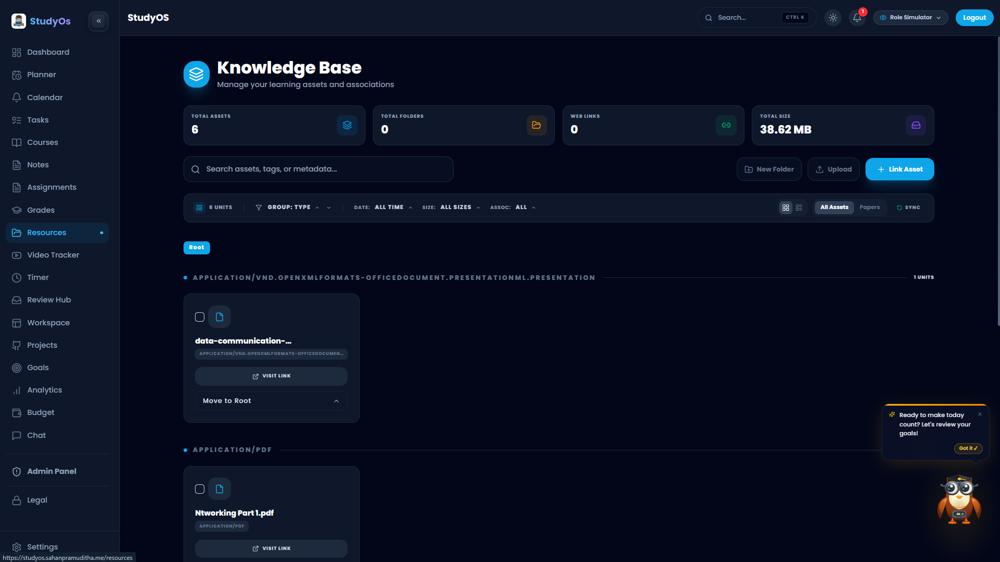
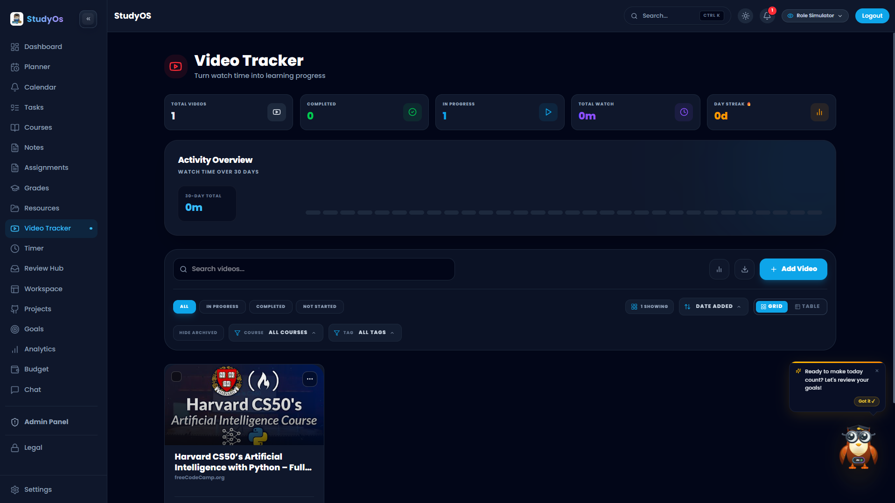

# StudyOS 🧠

[](https://www.npmjs.com/package/studyos)
[](https://vitejs.dev)
[](https://firebase.google.com)
[](https://tailwindcss.com)
[](https://reactjs.org)

**StudyOS** is a comprehensive, modern study workspace for students and developers. Manage courses, assignments, projects, notes, reminders, analytics, and more with seamless GitHub/Google Calendar integrations and role-based access. Built for productivity with real-time collaboration and advanced tools.

## ✨ Features

| Feature | Description |
|---------|-------------|
| **🎬 Video Lecture Player** | Interactive video player workspace: real-time YouTube API chapter timestamps parser, live YouTube top comments, bookmark CRUD manager (`+ Bookmark Now`, timestamp editor, note editor), formatted rich Markdown notes preview mode, LaTeX math quiz parser (`$f(n)$`), dedicated Table of Contents tab, and bottom glassmorphic learning dock. |
| **📚 Courses & Assignments** | Create/track assignments with progress trackers, resources, notes, task breakdowns, submissions, activity logs. |
| **🚀 Projects Hub** | Full project lifecycle: Task manager, bug tracker, code snippets, docs editor, GitHub sync, file manager, submission tracking, notes. |
| **📝 Smart Notes** | Rich editor, search, previews, lists with toolbar for organized study notes. |
| **⏰ Reminders & Planner** | Calendar views, event modals, Google Calendar sync, weekly planner. |
| **📊 Analytics** | Learning charts, heatmaps, stats cards for performance insights. |
| **💻 Workspace** | Multi-panel workspace with project selectors, code/docs/files/tasks/submissions views. |
| **🔍 Search & Admin** | Global search, admin dashboard, bulk actions, role-based access (Firestore rules). |
| **🎯 Integrations** | GitHub repos, Google Calendar, YouTube Data API, Firebase email/notifications, offline support. |
| **More** | Resources/videos/papers/review, error boundaries, themes, Google Auth. |

## 🖼️ Screenshots














Live Demo: [https://studyos.sahanpramuditha.me/](https://studyos.sahanpramuditha.me/)

GitHub: [SahanPramuditha-Dev/StudyOS](https://github.com/SahanPramuditha-Dev/StudyOS)

## 🛠️ Tech Stack

```
Frontend: React 19 + Vite + Tailwind CSS + MUI + Framer Motion
Backend: Firebase (Auth/Firestore/Storage/Functions/Analytics)
Services: Google Calendar API, GitHub API, SMTP Email (Functions)
Hooks: Custom (useGoogleCalendar, useOnline, useStorage)
Testing: Vitest
Quality: ESLint + Prettier
```

## ✅ Prerequisites

Before setting up StudyOS, ensure you have:

- **Node.js** 18.0.0 or higher
- **npm** 8.0.0 or higher (or yarn/pnpm)
- **Git** for cloning the repository
- **Firebase Project** with Firestore, Authentication, and Storage enabled
- **Google Cloud Project** with Calendar API and OAuth 2.0 credentials
- A code editor (VS Code recommended)

## 🚀 Quick Start

```bash
git clone https://github.com/SahanPramuditha-Dev/StudyOS.git
cd StudyOS
npm install
cp .env.example .env.local

# Important: Fill in your Firebase config in .env.local
# Important: Set VITE_GOOGLE_CLIENT_ID in .env.local for Google Login to work
npm run dev
```

Open [http://localhost:5173](http://localhost:5173)

### Environment Setup

Copy `.env.example` to `.env.local` and add:

```
VITE_FIREBASE_API_KEY=your_key
VITE_FIREBASE_AUTH_DOMAIN=yourproject.firebaseapp.com
VITE_FIREBASE_DATABASE_URL=https://yourproject-default-rtdb.firebaseio.com
VITE_FIREBASE_PROJECT_ID=yourproject
VITE_FIREBASE_STORAGE_BUCKET=yourproject.appspot.com
VITE_FIREBASE_MESSAGING_SENDER_ID=123
VITE_FIREBASE_APP_ID=your_app_id
GOOGLE_CALENDAR_API_KEY=your_gc_key
VITE_GOOGLE_CLIENT_ID=your_google_client_id
```

### Installation Troubleshooting

**Issue: npm install fails**
- Clear npm cache: `npm cache clean --force`
- Delete `node_modules` and `package-lock.json`, then reinstall
- Ensure Node.js version is 18+: `node --version`

**Issue: Port 5173 already in use**
- Use a different port: `npm run dev -- --port 3000`
- Or kill the process: `lsof -ti:5173 | xargs kill`

**Issue: Firebase authentication not working**
- Verify `VITE_FIREBASE_*` variables are set in `.env.local`
- Check Firebase Console: Auth → Authorized Domains includes your dev URL
- Restart dev server after env changes

**Issue: Google Calendar sync not working**
- Confirm `VITE_GOOGLE_CLIENT_ID` is in `.env.local`
- Verify OAuth redirect URI in Google Console matches your app URL
- Check browser console for CORS errors

## 📁 Project Structure

```
StudyOS/
├── public/          # Assets (logo/favicon)
├── src/
│   ├── components/  # UI (Sidebar/Footer/Modals)
│   ├── context/     # Auth/Theme/Reminder/GoogleCalendar
│   ├── features/    # Core modules (Assignments/Projects/Notes/Reminders/Analytics/Workspace)
│   ├── hooks/       # Custom hooks
│   ├── services/    # Firebase/Email/GoogleCalendar
│   └── utils/       # Helpers
├── functions/       # Cloud Functions (email)
├── server/          # Node (if extended)
├── firebase.json    # Hosting/Functions config
└── README.md
```

Detailed: [Projects Guide](src/features/Projects/PROJECTS_GUIDE.md), [Projects Summary](PROJECTS_FEATURE_SUMMARY.md)

UI Standards: [UI System Guidelines](docs/UI_SYSTEM_GUIDELINES.md)

## 🗄️ Database Schema (Firestore)

Key collections and structure:

```
users/
├── {userId}
│   ├── email: string
│   ├── name: string
│   ├── role: 'student' | 'instructor' | 'admin'
│   └── profile: { avatar, bio, ... }

courses/
├── {courseId}
│   ├── title: string
│   ├── description: string
│   ├── owner: userId
│   ├── members: [userId]
│   └── createdAt: timestamp

assignments/
├── {assignmentId}
│   ├── title: string
│   ├── courseId: reference
│   ├── dueDate: timestamp
│   ├── submissions: []
│   └── rubric: { ...criteria }

projects/
├── {projectId}
│   ├── title: string
│   ├── tasks: []
│   ├── collaborators: [userId]
│   └── githubRepo: string (optional)

notes/
├── {noteId}
│   ├── title: string
│   ├── content: rich text
│   ├── userId: reference
│   └── tags: [string]

reminders/
├── {reminderId}
│   ├── title: string
│   ├── dueDate: timestamp
│   ├── userId: reference
│   └── completed: boolean
```

See [firestore.rules](firestore.rules) for role-based security rules.

## 🔍 Quality & Build

```bash
npm run lint      # ESLint
npm run build     # Production build
npm run preview   # Local prod server
npm run test      # Vitest
```

### Testing Guide

**Run all tests:**
```bash
npm run test
```

**Run tests in watch mode (auto-rerun on file changes):**
```bash
npm run test -- --watch
```

**Run a specific test file:**
```bash
npm run test -- src/components/PageHeader.test.jsx
```

**Run tests with coverage:**
```bash
npm run test -- --coverage
```

**Test file locations:** Tests are colocated with components using `.test.jsx` or `.spec.jsx` suffix.

**Debugging tests:** Use `test.only()` to run a single test, or `test.skip()` to skip tests during development.

## Deployment

### Cloudflare Pages frontend

1. `npm run build`
2. Deploy the generated `dist/` folder to Cloudflare Pages.
3. Keep `public/_redirects` in place so React Router routes resolve on refresh.

### Firebase backend

1. `firebase deploy --only functions`
2. `firebase deploy --only firestore:rules`
3. Configure Auth providers/domains in Firebase Console.

See [firebase.json](firebase.json), [firestore.rules](firestore.rules).

**Production Notes**:
- Role-based access via Firestore rules (no hardcoded emails).
- Email via Functions `sendEmail` (SMTP secrets).
- Reminder scheduling via Cloud Functions.
- Profile/account ops via shared services.

## 🔧 Troubleshooting

### Build Issues

**Error: Cannot find module or import**
- Run `npm install` to ensure all dependencies are installed
- Clear Vite cache: `rm -rf node_modules/.vite`
- Restart dev server

**Error: Firebase initialization failed**
- Verify all `VITE_FIREBASE_*` environment variables
- Check Firebase Console project is active
- Ensure Firebase Authentication is enabled

### Runtime Issues

**Orion AI not responding**
- Check browser console for errors
- Verify AI service endpoint is configured
- Check network tab for failed API calls

**Google Calendar sync not syncing**
- Verify user granted Calendar API permissions during OAuth
- Check Firebase Functions logs for errors
- Ensure `GOOGLE_CALENDAR_API_KEY` is valid in Cloud Functions

**Firestore permissions errors**
- Review [firestore.rules](firestore.rules) for user role
- Ensure user is authenticated and has proper role set
- Check Firestore rules in Firebase Console

### Performance Issues

**Slow load times**
- Run `npm run build` and check bundle size
- Use Chrome DevTools Performance tab to identify bottlenecks
- Verify Cloud Functions are in the same region as Firestore

**High Firestore costs**
- Implement efficient queries (avoid full collection scans)
- Use composite indexes from Firestore recommendations
- Consider pagination for large datasets

## ❓ FAQ

**Q: Can I use StudyOS for commercial purposes?**
A: StudyOS is proprietary. Commercial use requires written permission. Contact: sahan.dev.tech@gmail.com

**Q: Is there a mobile app?**
A: Mobile app (Capacitor-based) is on the roadmap. Currently web-only.

**Q: Does StudyOS work offline?**
A: Offline support is implemented with Firebase offline persistence for read operations.

**Q: How do I invite other users to a course?**
A: Course owners can add members via the course settings; members receive an invite notification.

**Q: Can I export my data?**
A: Data export features are under development. Currently, you can export notes and assignments individually.

**Q: How are my files stored?**
A: Files are stored in Firebase Storage with user-level access controls via Firestore rules.

**Q: Does StudyOS support multiple courses per user?**
A: Yes, unlimited courses. Enroll in or create as many as needed.

## 📚 Related Documentation

- [Architecture Overview](docs/ARCHITECTURE_OVERVIEW.md) - System design and module relationships
- [Development Guide](docs/DEVELOPMENT.md) - Detailed setup and dev workflow
- [Deployment Guide](docs/DEPLOYMENT.md) - Production deployment procedures
- [UI System Guidelines](docs/UI_SYSTEM_GUIDELINES.md) - Design system and component standards
- [Security Guide](docs/SECURITY.md) - Security practices and data protection
- [Testing Guide](docs/TESTING.md) - Testing strategy and best practices
- [Developer Guide](src/features/Projects/DEVELOPER_GUIDE.md) - Advanced development tips
- [Projects Feature Summary](PROJECTS_FEATURE_SUMMARY.md) - Detailed feature breakdown

## 🤝 Contributing

Contributions are welcome! Please follow these steps:

1. Fork the repository
2. Clone your fork: `git clone https://github.com/yourusername/StudyOS.git`
3. Create a feature branch: `git checkout -b feat/your-feature`
4. Make changes and test: `npm run test`
5. Lint your code: `npm run lint`
6. Commit with clear message: `git commit -m 'feat: add X'`
7. Push to your fork and create a Pull Request to `main`

**PR Guidelines:**
- Include tests for new features
- Update documentation if needed
- Follow ESLint rules (run `npm run lint`)
- Reference any related issues in PR description

[Report Issues](https://github.com/SahanPramuditha-Dev/StudyOS/issues/new) | [View Contributing Guide](CONTRIBUTING.md)

## 📄 License

StudyOS is proprietary software.

This repository is provided for personal, educational, and evaluation purposes only.

Commercial use, redistribution, and resale are prohibited without written permission.

If you are interested in licensing StudyOS for commercial use, please contact:

sahan.dev.tech@gmail.com

## 🚀 Roadmap

### Phase 1: Core Platform Infrastructure (Completed ✓)
- [x] Multi-tenant Firebase authentication & Security Rules
- [x] Courses, Assignments, and Projects Hub with GitHub repo sync
- [x] Smart Notes Hub, Planner, Reminders, and Analytics Dashboard

### Phase 2: AI Companion & Interactive Video Workspace (Completed ✓)
- [x] Orion AI Copilot for summaries, active recall quizzes & LaTeX math rendering (`$f(n)$`)
- [x] YouTube Data API integration: dynamic chapter timestamps & live top comments
- [x] Bookmark CRUD Workspace (`+ Bookmark Now`, timestamp editor, note editor, seek/delete)
- [x] Rich Markdown Notes Preview & Edit modes with toolbar formatting
- [x] Glassmorphic Learning Dock with exact timestamp progress calculation

### Phase 3: Collaboration & Offline Engine (In Progress - Q3 2026)
- [ ] Real-time multi-user collaborative study rooms & live cursor notes
- [ ] 2-Way Google Calendar sync & automated reminder webhooks
- [ ] Progressive Web App (PWA) offline support with IndexedDB local caching
- [ ] AI Spaced Repetition Flashcards (SuperMemo SM-2 algorithm)

### Phase 4: Mobile Ecosystem & LMS Connectors (Q4 2026 - Q1 2027)
- [ ] Native iOS & Android mobile apps (Capacitor / React Native)
- [ ] Canvas & Blackboard LMS API connectors for automatic course & deadline imports
- [ ] Predictive learning fatigue analytics & exam readiness AI score

## 📞 Support

- 💬 Discord/Forum (TBD)
- 🐛 [Report Issues](https://github.com/SahanPramuditha-Dev/StudyOS/issues)
- 📧 Email: sahan.dev.tech@gmail.com
- 💼 Commercial inquiries: sahan.dev.tech@gmail.com

⭐ **Star on GitHub** if you find StudyOS helpful!

---

Built with ❤️ for students and developers worldwide.

